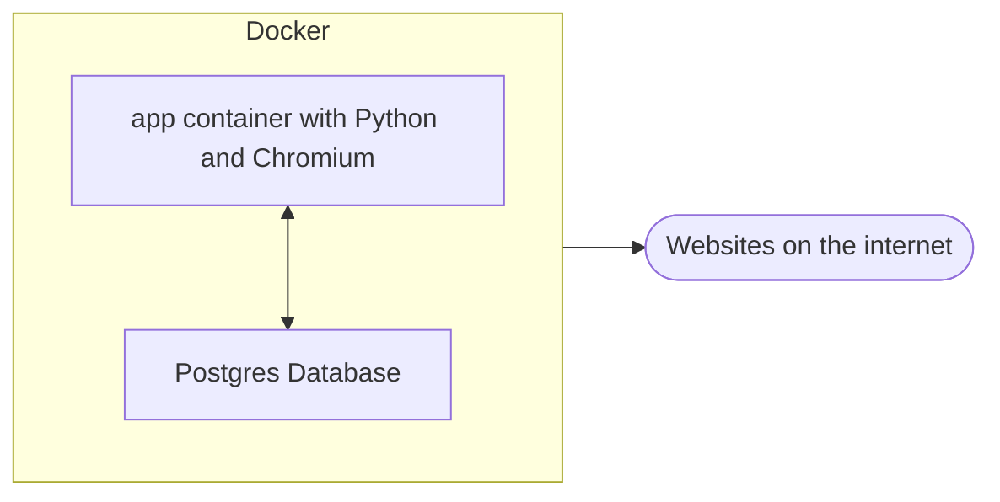

# Coffee Scraper

A simple experiment in webscraping both with and without Selenium.

 

## Description

The focus is on getting current price information from some websites for a particular
brand of coffee I drink a lot.

Some of those websites are very straight forword to parse and even provide meta tags
that can be directly used to extract the price information, others are slightly more
complicated and have euros and cents in different elements.

But that is all pretty simple, however, some sites actively block scraping robots,
by looking at the User-Agent string, or provide empty skeleton pages that are completely
build up using javascript. Changing a User-Agent string is straight-forward,
but those dynamic pages are an issue, because downloading the HTML is no
longer sufficient.

Fortunately this can be solved with [Selenium](https://www.selenium.dev/), a framework
that cann be used to automate interaction with a full web browser.

In our case we use Chromium on a Debian based Docker image. The high level setup looks
something like this:

We have a separate container with a Postgres database to store the results of our scraping,
and a container that runs our app.

## Additional functionality

Besides scraping price information from websites and storing this in a database,
some additional functionality is provided:

- an Excel compatible spreadsheet is created with the help of [openpyxl](https://openpyxl.readthedocs.io)
- an HTML page is created with the help of [jinja](https://jinja.palletsprojects.com) and [chart.js](https://www.chartjs.org/)
- an email is sent when the minimum price today is lower by a configurable amount than the minimum price yesterday
- the list of recipients can also be configured

## Caveats

The code isn't very robust and not very well tested. It is not production code but meant as a personal experiment. 

## Build and deploy

The idea is to run the container with the app once a day, using a cronjob on the machine that hosts my docker service.

See [docs/build.md](docs/build.md)
